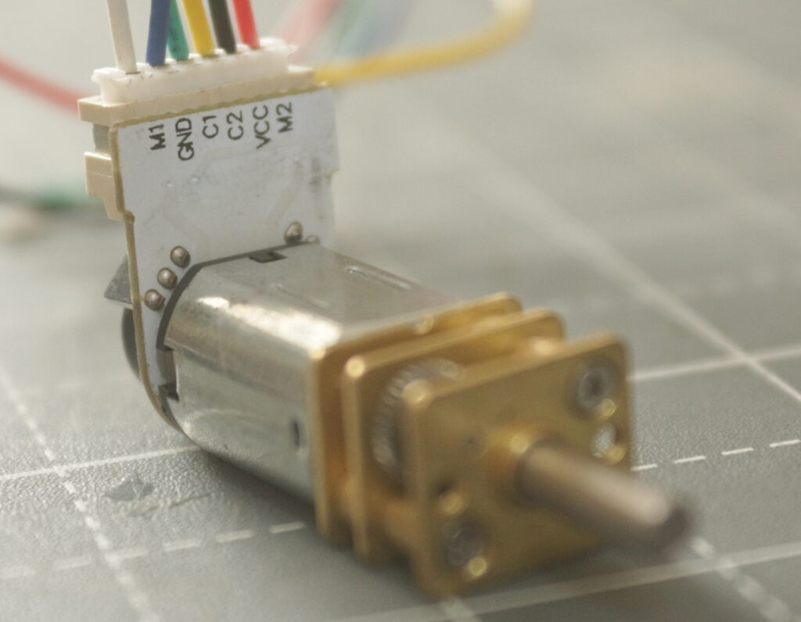

# Jetbot_ROS

Differential wheeled robot based on Jetson Orin Nano Dev kit.

## How to set the jetpack

## Install ROS 2 foxy

https://docs.ros.org/en/foxy/Installation/Ubuntu-Install-Debians.html

## How to set up Jupyter Lab 4 and jupyter_clickable_image_widget (neccesary for collect data script)
```
pip install jupyterlab==4.0.10 ipywidgets
curl -fsSL https://deb.nodesource.com/setup_20.x | sudo -E bash -
sudo apt install -y nodejs
sudo npm install -g yarn
git clone https://github.com/jaybdub/jupyter_clickable_image_widget
cd jupyter_clickable_image_widget
cd js
yarn install
yarn add @jupyter-widgets/controls (maybe before?)
yarn run build:prod
cd ..
pip install .
jupyter lab build
```

Connections:
<div style="display: flex; align-items: flex-start;">

<!-- Tabla a la izquierda -->
<div style="flex: 1;">
  <strong>Connections:</strong>  
  <table>
    <thead>
      <tr>
        <th>Jetson Orin Nano</th>
        <th>Motor Driver</th>
        <th>Encoder L</th>
        <th>Encoder R</th>
      </tr>
    </thead>
    <tbody>
      <tr><td>1</td><td>3V3</td><td></td><td></td></tr>
      <tr><td>2</td><td></td><td>VCC</td><td></td></tr>
      <tr><td>3</td><td>SDA</td><td></td><td></td></tr>
      <tr><td>4</td><td></td><td></td><td>VCC</td></tr>
      <tr><td>5</td><td>SCL</td><td></td><td></td></tr>
      <tr><td>6</td><td>GND</td><td></td><td></td></tr>
      <tr><td>9</td><td></td><td></td><td>GND</td></tr>
      <tr><td>11</td><td></td><td></td><td>C1</td></tr>
      <tr><td>12</td><td></td><td></td><td>C2</td></tr>
      <tr><td>14</td><td></td><td>GND</td><td></td></tr>
      <tr><td>15</td><td></td><td>C1</td><td></td></tr>
      <tr><td>16</td><td></td><td>C2</td><td></td></tr>
      <tr><td></td><td>M1</td><td>M1-M2</td><td></td></tr>
      <tr><td></td><td>M2</td><td></td><td>M1-M2</td></tr>
    </tbody>
  </table>
</div>

<!-- Imágenes a la derecha -->
<div style="flex: 1; padding-left: 20px;">
  <br>
  <br>
  
</div>

</div>


